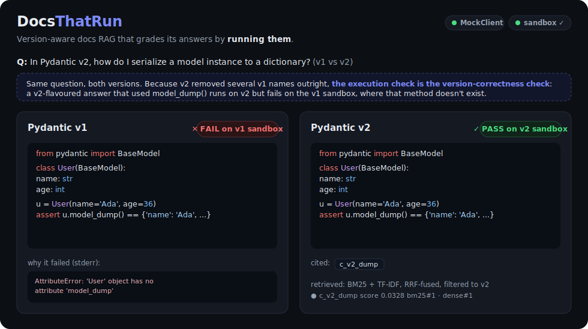

# DocsThatRun

**Version-aware documentation RAG that grades its answers by running them.**

[](https://github.com/RiceSouffle/COOL-TOOL/actions/workflows/evals.yml)


Most docs assistants answer from whatever they retrieved and hope the code is
right. DocsThatRun answers questions about a *specific* version of a
fast-moving library (Pydantic **v1** vs **v2**), cites the docs it used, refuses
when the docs don't cover the question — and then **executes the generated code
against the pinned version of the library in an isolated sandbox** and scores it
pass/fail.

Because Pydantic v2 removed several v1 names outright (their imports raise), the
execution check *is* the version-correctness check: a v2-flavoured answer run
against the v1 sandbox fails, and vice-versa.



> The `/compare` view above: the same question answered for both versions, each
> snippet run in its own pinned sandbox. The v1 answer used `model_dump()` — a v2
> API that doesn't exist in v1 — so the v1 sandbox surfaces the exact
> `AttributeError`. That's the version-lock, proven by execution rather than asserted.

```
question + target version
      │
      ▼
 hybrid retrieval  (BM25 + TF-IDF, fused with RRF, filtered to the target version)
      │
      ▼
 cited answer  (Claude, structured JSON: answer + code + citations + abstained)
      │
      ▼
 execution grade  (run the snippet in the pinned-version venv → pass/fail)
      │
      ▼
 evals + CI gate  (recall@k, MRR, executable-%, abstention, version-lock, failure taxonomy)
```

## Why this is interesting

- **Execution-graded, not vibes-graded.** The snippet has to actually run
  against the version it claims to target.
- **Version drift is handled and measured.** A v2 answer never reaches a v1
  query; a v1 answer that used a removed API fails the sandbox.
- **Honest abstention.** Out-of-corpus questions are refused, not hallucinated.
- **Failure taxonomy.** Every graded answer is bucketed (wrong-version-API /
  malformed-code / wrong-assert / retrieval-miss / pass), so a regression is
  attributable to a stage instead of a mystery.
- **Runs on the standard library.** Retrieval, the sandbox grader, and the eval
  harness have **zero pip dependencies** — clone and run the evals immediately.

## Try it — the interactive demo

```bash
make sandbox                              # build the pinned v1/v2 venvs (once)
pip install fastapi uvicorn               # server only; the core needs nothing
make serve                                # → http://localhost:8000
```

The single-page UI (vanilla JS, no build step) walks the whole pipeline: type a
question, pick **v2 / v1 / Compare both**, and watch retrieval → cited answer →
syntax-highlighted code → a green **PASS** / red **FAIL** badge from the real
sandbox. It works offline with the `MockClient` (no API key); set
`ANTHROPIC_API_KEY` for real Claude answers.

Prefer the terminal?

```console
$ python3 -m docsthatrun compare "In Pydantic v2, how do I serialize a model to a dict?"

── Pydantic v1 ──────────────────────────────
  Answer [v1]   ✗ FAIL on v1 sandbox
    │ u = User(name='Ada', age=36)
    │ assert u.model_dump() == {'name': 'Ada', 'age': 36}
  stderr:
    AttributeError: 'User' object has no attribute 'model_dump'

── Pydantic v2 ──────────────────────────────
  Answer [v2]   ✓ PASS on v2 sandbox
    cited: c_v2_dump
```

Or run it fully containerized (API + both sandboxes baked in):

```bash
docker compose up --build                 # → http://localhost:8000
```

## Quickstart (evals & API)

```bash
# 1. Retrieval metrics — no install, no network, no API key:
python3 -m docsthatrun.evals.run_evals

# 2. Build the two pinned-version sandboxes, then run the full eval incl. real
#    execution grading (offline MockClient):
make sandbox
python3 -m docsthatrun.evals.run_evals --answers --gate --client mock

# 3. Real answers from Claude — set a key, then:
export ANTHROPIC_API_KEY=sk-ant-...
python3 -m docsthatrun.evals.run_evals --answers --client anthropic

# 4. Serve the API + demo UI:
pip install -r requirements.txt
uvicorn app.main:app --reload        # POST /ask, POST /compare, GET /health
```

## Current numbers (seed corpus)

Measured by `python3 -m docsthatrun.evals.run_evals --answers` on the committed
data (27 doc chunks, 25 answerable golden questions, 6 unanswerable):

| Metric | Value | Notes |
|---|---|---|
| retrieval recall@5 | **1.00** | small, clean seed corpus — see caveat below |
| retrieval MRR | **0.98** | one item's relevant chunk isn't rank-1 on the larger corpus |
| reference snippets executable on target version | **25 / 25** | proves the sandbox + drift mechanism |
| crisply version-locked checks | **17 / 25 (68%)** | fail on the *other* version; the rest are v1 APIs kept as deprecated v2 shims |
| unanswerable abstention | **100%** | out-of-corpus questions refused |
| answerable over-abstention | **0%** | in-corpus questions answered |

> **Honest caveat:** these are seed-corpus numbers. recall@5 = 1.0 reflects a
> small, hand-curated corpus with clean version separation, *not* messy
> real-world docs. The `MockClient` used in CI replays the golden answer key, so
> its executable-% is a **plumbing** check — the real measurement comes from
> running with `--client anthropic`. Scaling to the real messy corpus and
> reporting Claude's true executable-% is the next milestone
> ([ROADMAP.md](ROADMAP.md)).

## How the pieces map to files

| Concern | File |
|---|---|
| version-tagged corpus | [`data/corpus/pydantic_corpus.jsonl`](data/corpus/pydantic_corpus.jsonl) |
| hand-labeled golden set | [`data/golden/golden_set.jsonl`](data/golden/golden_set.jsonl) |
| hybrid retrieval + version filter | [`docsthatrun/retrieve.py`](docsthatrun/retrieve.py) |
| cited/abstaining answer via Claude | [`docsthatrun/llm.py`](docsthatrun/llm.py) |
| execution grader (pinned venvs, process-group isolation) | [`docsthatrun/sandbox.py`](docsthatrun/sandbox.py) |
| eval harness + CI gate + failure taxonomy | [`docsthatrun/evals/run_evals.py`](docsthatrun/evals/run_evals.py) |
| HTTP API | [`app/main.py`](app/main.py) |
| interactive demo UI | [`app/static/index.html`](app/static/index.html) |
| terminal CLI (`ask` / `compare`) | [`docsthatrun/cli.py`](docsthatrun/cli.py) |
| container image | [`Dockerfile`](Dockerfile) · [`docker-compose.yml`](docker-compose.yml) |
| design decisions & tradeoffs | [`DECISIONS.md`](DECISIONS.md) |

See [DECISIONS.md](DECISIONS.md) for why each choice was made (and its honest
limitations), and [ROADMAP.md](ROADMAP.md) for the path from this slice to a
flagship portfolio piece.
